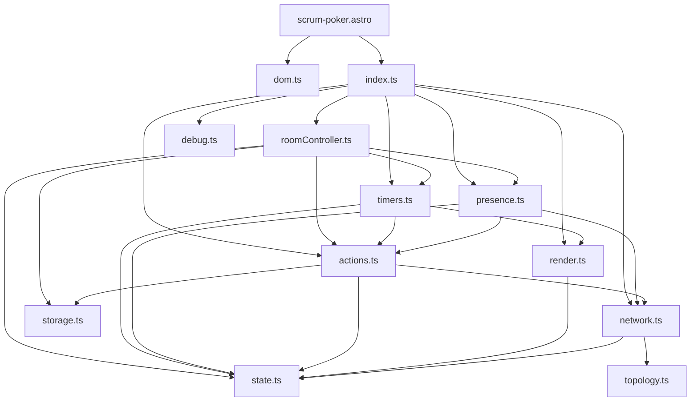
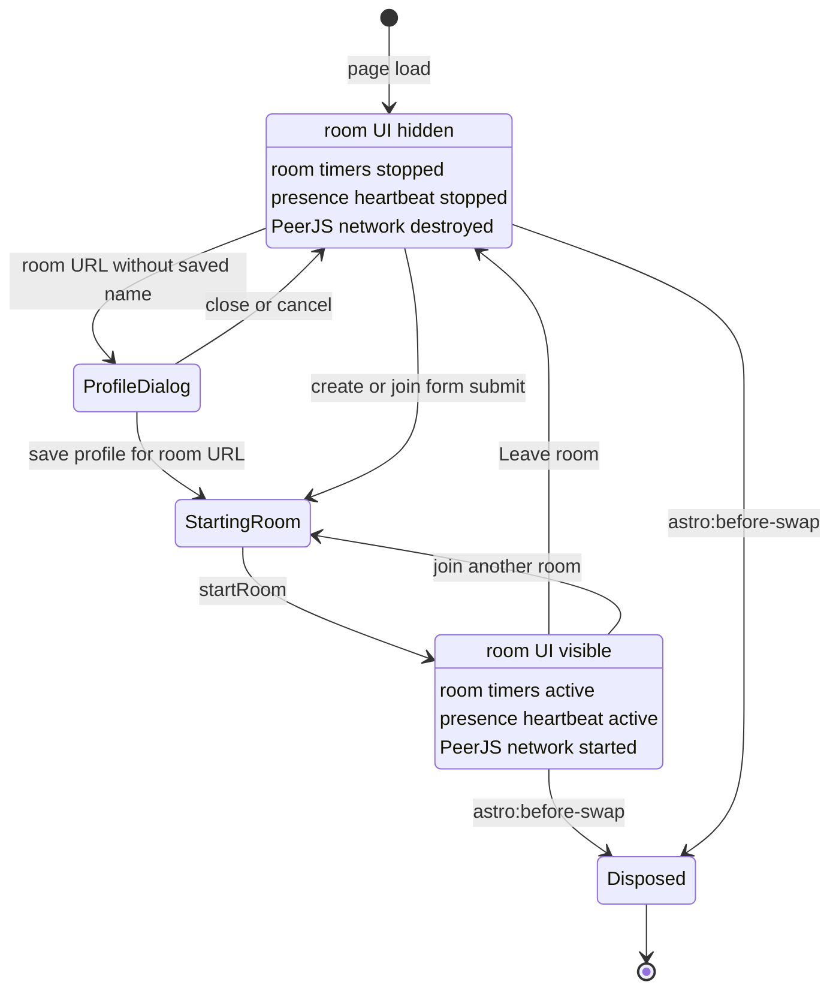
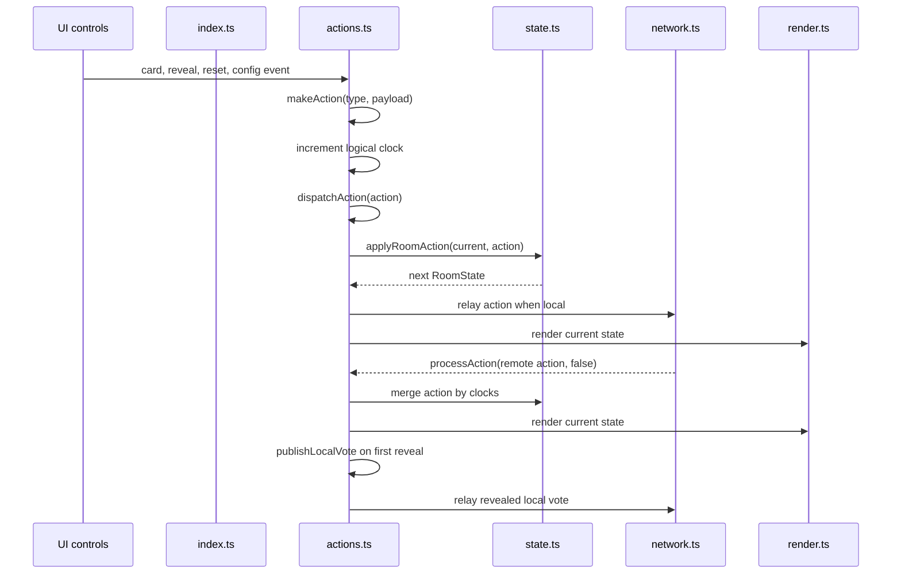
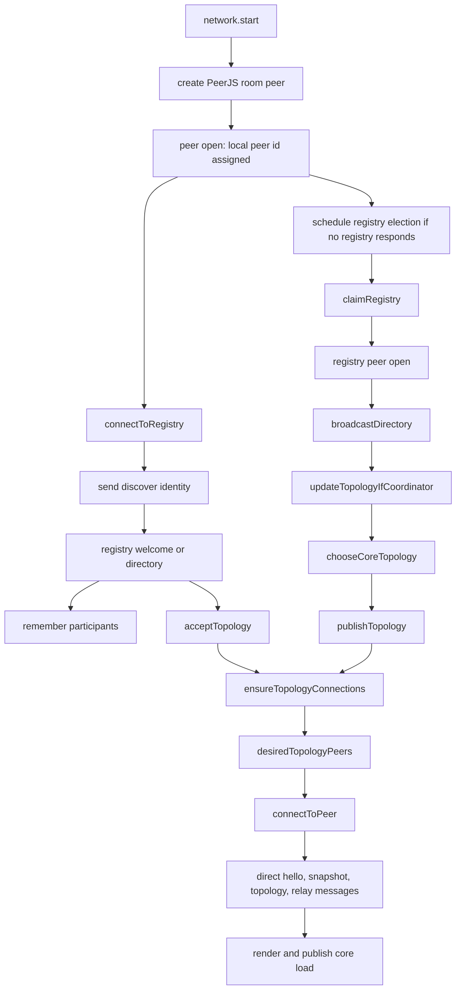
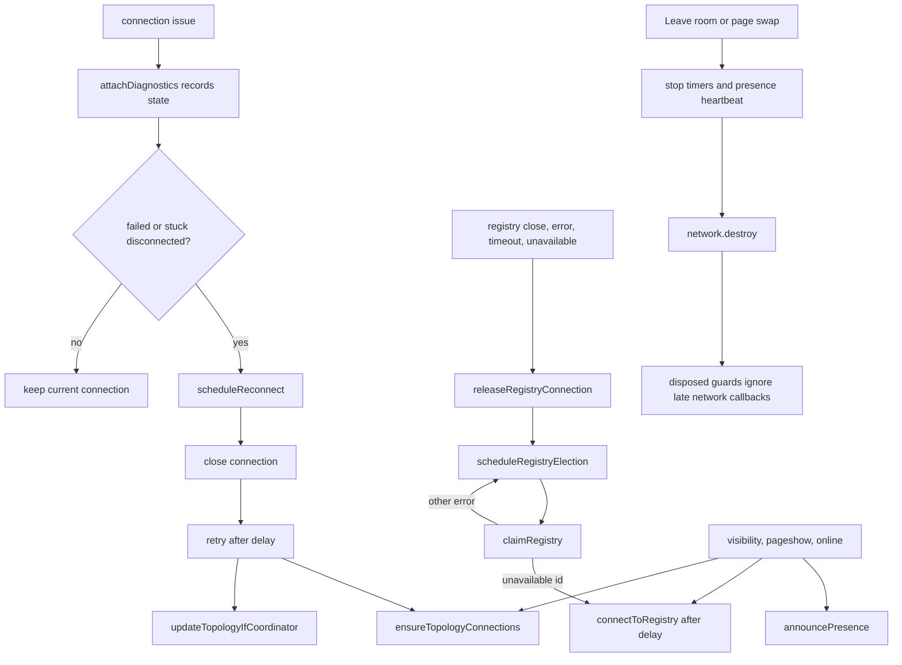

# Scrum Poker Architecture

These diagrams describe the current Scrum Poker implementation under
`src/scripts/scrumPoker`. They reflect the code structure as implemented, not a
target architecture.

## Module Architecture

## Room Lifecycle

## Action And Voting Flow

## Networking And Topology Flow

## Fallback And Recovery Paths

